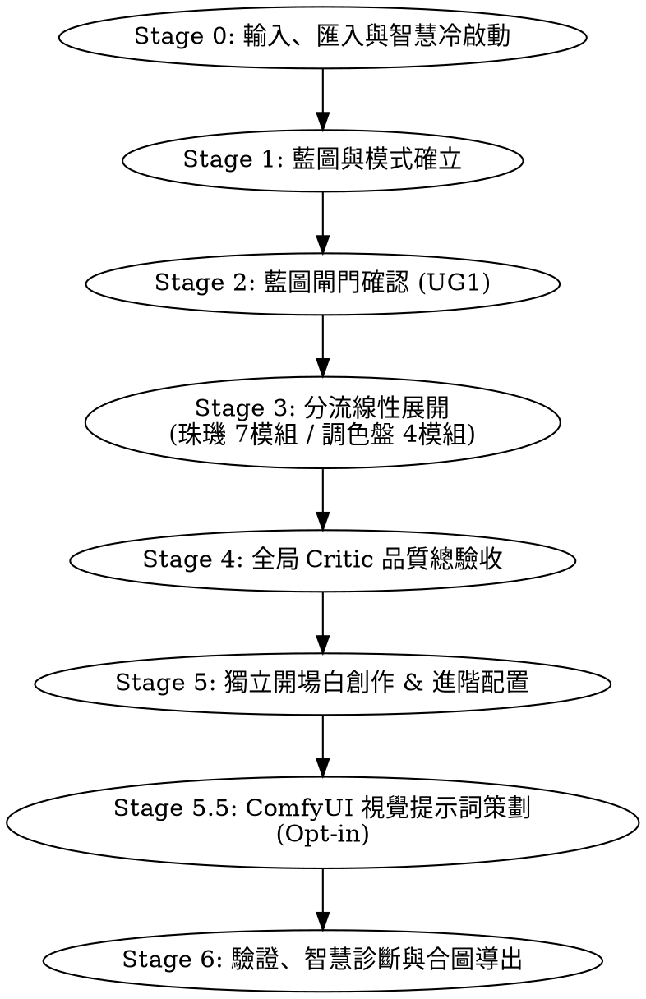

# SillyTavern V3 終極生成工作流：系統架構、技術指標與規範全景書

本文件描述了為 SillyTavern V3 量身打造、全面升級的「主從式多智能體 (Master-Subagent)」、「雙模式自適應」與「解耦化」角色卡生成工作流。

---

## 1. 系統設計哲學 (Design Philosophy)

本工作流旨在解決大語言模型（LLM）在生成角色卡時常出現的「Token 浪費」、「雙遞迴污染（Token 融化）」、「AI 味/白描破壞」、「多角色混亂」以及「後期維護困難」等痛點。系統遵循以下三大核心設計哲學：

1.  **草稿極簡化 (Minimalist Drafts)**：手寫草稿（YAML/Markdown）保持最純淨、最直觀的內容，便於人類隨時微調與版本管理。
2.  **規格編譯化 (Compiler-Driven Specifications)**：XML 包裹標籤、常態雙遞迴防禦（`prevent_recursion` 隔離）、空白主卡 Description 處理、EJS 變量正則清除等死板的「酒館硬性規格」，全部在編譯期（`st-forge`）自動、動態熱修補。
3.  **多智能體物理隔離 (Physically Isolated Multi-Agent)**：
    - 主控機（Director）負責狀態機推進與人機引導。
    - 寫作與審查 Subagents 按「模式」和「任務」（珠璣、調色盤、開場白、ComfyUI 視覺策劃）進行物理目錄解耦，完全避免規則相互污染，極致節省上下文。

---

## 2. 核心架構與資料解耦規範 (Data Architecture Paradigm)

在 V3 規範中，**角色主卡 (Main Card) 僅作為結構載體**，真正的故事細節與台詞語料全數解耦。

### A. 主卡載體 (Main Card Shell)
*   **保留欄位**：`name` (角色名稱)、`description` (極短的一句話身份/外觀概括，用於酒館 UI 列表顯示)。
*   **動態注入欄位**：`first_mes` (首發開場白) 與 `alternate_greetings` (多路分歧開場白)。在編譯時自動從解耦的 `greetings.yaml` 中讀取並無感合併，不再為了節約 Token 而淨空主卡開場白。
*   **強制淨空欄位**：`personality`, `scenario`, `mes_example` **在編譯時必須完全空白**，避免常駐佔用 LLM 的上下文 Token，其內容全部由世界書（Worldbook）的按需觸發機制替代。

### B. 世界書多維分類遞迴編譯 (Categorized Worldbook Rules)
世界書會被嵌入角色 JSON 中，命名空間為 `_{{name}}_`。編譯器（`st-forge`）在導出時會自動補全以下三種條目：

1.  **設定檔條目 (`{{name}}_設定`)**：
    - **包含內容**：核心設定（珠璣 1~5 模組，或調色盤之「基礎信息」、「性格調色盤」、「三面性」、「二次解釋」）。
    - **觸發關鍵字**：`["{{name}}", "{{char}}"]`
    - **XML 標籤包裹**：編譯時根據模式自動用 `<character_basic>`、`<personality_palette>`、`<tri_faceted>`、`<secondary_interpretation>` 等 XML 標籤包裹純 YAML，確保邊界清晰。
2.  **語料包條目 (`{{name}}_語料`)**：
    - **包含內容**：對話範例與語料（珠璣模組 6 與 模組 7 初始對話）。
    - **觸發關鍵字**：`["{{name}}", "{{char}}"]`
3.  **多維分類世界設定條目（選填，`世界設定/` 目錄）**：
    - **目錄結構**：支援在 `世界設定/` 子目錄下建立 `人物/`、`組織/`、`地理/`、`概念/` 四大子目錄，進行深度遞迴掃描。
    - **優先級覆蓋與自動 Fallback 機制**：
        - 優先尊重 YAML 檔案中創作者手寫的 `config.position` 與 `config.insertion_order`。
        - 若無手寫，編譯器將根據該檔案所處的分類子目錄自動補全最優屬性：
            *   `世界設定/人物/` -> `insertion_order: 30`, `position: "after_char"`（最高優先級，緊密貼近角色上下文）。
            *   `世界設定/組織/` -> `insertion_order: 35`, `position: "after_char"`。
            *   `世界設定/地理/` -> `insertion_order: 40`, `position: "before_char"`（提供巨觀環境背景）。
            *   `世界設定/概念/` -> `insertion_order: 45`, `position: "before_char"`。
            *   其餘無分類的預設 Fallback -> `insertion_order: 50`, `position: "after_char"`。
    - **雙遞迴防禦 (Prevention of Double Recursion)**：編譯器在打包所有世界設定條目時，將自動且強制注入 `"prevent_recursion": true` 與 `"exclude_recursion": true`，100% 防範兩個世界條目互相呼應引用導致 Token 融化與上下文暴漲的雙遞迴災難。

---

## 3. 多模式草稿與專案目錄結構 (Multi-Mode Directory Structure)

草稿儲存於 `drafts/` 目錄中，`st-forge` 支援「珠璣模式」與「調色盤模式」目錄的自動掃描與混合拼裝。

### A. 珠璣模式 (Zhuji Mode)
適用於需要極端詳細、白描與完整台詞堆疊的角色。
```text
drafts/oregairu-ero/
├── 模組0_概覽.yaml                   <-- 模式: 珠璣
├── greetings.yaml                    <-- 全域解耦開場白 (新位置！)
├── 世界設定/                          <-- 專案世界設定目錄 (支援多維遞迴分類)
│   ├── 人物/
│   │   └── 戶塚彩加.yaml
│   ├── 組織/
│   │   └── 侍奉部.yaml
│   ├── 地理/
│   │   └── 總武高等學校.yaml
│   └── 概念/
│       └── 侍奉部運作機制.yaml
└── 雪乃/                              <-- 角色 A 專屬目錄
    ├── 模組1_外顯.yaml
    ├── 模組2_內質.yaml
    ├── 模組3_外延.yaml
    ├── 模組4_外延擴展.yaml
    ├── 模組5_特質細化.yaml
    ├── 模組6_場景語料.yaml
    └── 模組7_自我介紹.yaml
```

### B. 調色盤模式 (Palette Mode)
適用於多面性格、在不同壓力或環境下有截然不同行為與語言風格的角色。
```text
drafts/oregairu-ero/
├── 模組0_概覽.yaml                   <-- 模式: 調色盤
├── greetings.yaml                    <-- 全域解耦開場白 (新位置！)
└── 雪乃/
    ├── 基礎信息.yaml                  <-- 姓名、身份、年齡、外貌概括等
    ├── 性格調色盤.yaml                <-- 底色、主色調、點綴、場景衍生描述
    ├── 三面性.yaml                    <-- 不同壓力下的面：觸發、能量、語料、身體、功能
    └── 二次解釋.yaml                  <-- 為什麼有這種性格、底層心理學動機（Why）
```

### B. 調色盤模式 (Palette Mode)
適用於多面性格、在不同壓力或環境下有截然不同行為與語言風格的角色。
```text
drafts/oregairu-ero/
├── 模組0_概覽.yaml                   <-- 模式: 調色盤
├── greetings.yaml                    <-- 全域解耦開場白 (新位置！)
├── comfyui_prompts.yaml              <-- 全域視覺提示詞 (新位置！)
└── 雪乃/
    ├── 基礎信息.yaml                  <-- 姓名、身份、年齡、外貌概括等
    ├── 性格調色盤.yaml                <-- 底色、主色調、點綴、場景衍生描述
    ├── 三面性.yaml                    <-- 不同壓力下的面：觸發、能量、語料、身體、功能
    └── 二次解釋.yaml                  <-- 為什麼有這種性格、底層心理學動機（Why）
```

---

## 4. 解耦技能組與高可用工具箱 (Skills & High-Utility Tools)

### A. 物理拆分的 Subagent 技能組
1.  **`st-creator-zhuji-skill` / `st-critic-zhuji-skill`**：專注於 7 階段線性展開的創作與全局審查。
2.  **`st-creator-palette-skill` / `st-critic-palette-skill`**：專注於調色盤底色、主色、三面性（觸發/能量/語料/身體/功能）與二次心理學動機的寫作。
3.  **`st-greetings-skill` / `st-critic-greetings-skill`**：完全剝離設定的「純文學開場系統」，硬性規定篇幅必須介於 400~800 字之間，著重富含細節神態動作的白描，拒絕 Puppeteering 以及拒絕封閉式結局。
4.  **`st-comfyui-prompt-skill`**：自動提取外貌特徵，與創作者討論並生成高權重英文生圖標籤（在對話中直接輸出呈現給創作者，方便其複製到 ComfyUI，不產生物理 YAML 檔案）。

### B. st-forge 進階工具鏈
1.  **反向智能解包 (`decompile_chara_card`)**：
    - 一鍵解析現有卡片（PNG / JSON），自動判定模式並還原為標準 YAML 草稿。
2.  **實體 PNG 角色卡一鍵打包 (`export_png_card`)**：
    - 結合頭像 PNG 圖像，將 V3 卡片 JSON 編譯寫入 PNG 的 `tEXt` 輔助文本區塊。
3.  **分身模式轉換 (`convert_chara_draft_mode`)**：
    - 提供珠璣 ↔ 調色盤的雙向 AI 轉換。採用「Side-by-Side 複製分身」安全防禦，絕不遺失創作者的手寫原檔。
4.  **草稿分片熱修補 (`patch_yaml_draft`)**：
    - 支援定位特定屬性路徑（如 `性格調色盤.主色調`）原位局部修改 YAML 屬性，杜絕 Token 浪費。
5.  **二創智慧搜尋與冷啟動提煉 (`extract_lore_facts` / `init_draft_from_bootstrap`)**：
    - **多語言名稱擴展**：自動利用 LLM 知識庫將輸入的中文名轉譯為英文與日文，破除語系壁壘。
    - **多來源定向精準搜尋**：避開內容籠統的一般百科，優先定向搜尋 Fandom Wiki、萌娘百科、Pixiv 百科等動漫遊戲社群專業資料庫，提取語音台詞、關係圖譜與劇情。
    - **滑動視窗跨語系提煉 (Cross-lingual Ingestion & Sliding-window)**：採用滑動視窗切片（每片 3000 字）讀取多語言大型文本，提煉時由 LLM 自動將英文/日文翻譯、蒸餾並彙整為高品質正體中文（zh-TW）行為事實。
    - **增量安全追加 (Incremental Merger)**：與現有 `imported-base.yaml` （事實寄存器）進行 Deep Merge，只增量追加，不暴力覆寫，有衝突時輸出報告。
    - **模式自適應推薦與一秒冷啟動**：分析事實人設給出模式推薦（推薦珠璣或調色盤），並一鍵初始化對應模式的全套空 YAML 草稿骨架。
6.  **智慧品質診斷與評分門禁 (`audit_compiled_card`)**：
    - 獨立評估引擎，對已編譯卡片掃描 5 大關鍵技術指標，輸出 Markdown 診斷報告書（`exports/<character_id>_audit_scorecard.md`）。
    - **品質門禁安全閥**：在嚴格模式（`strictReview: true`）下，診斷評分低於 85 分將硬性中斷並阻斷編譯，防範低品質或帶有敘事禁詞、Puppeteering 缺陷的卡片流出。
7.  **Regex Linter 禁詞安全閥**：
    - 內建掃描「敘事禁詞」（如「一絲」、「一抹」、「弧度」、「勾起」、「勾勒」），支援 `# linter-allow` 註釋或全局豁免名單。嚴格模式下阻斷編譯，常規模式下黃色警告放行。
8.  **決策暫存註冊表 (`pending_decisions.json`)**：
    - 管理 pending 決策，常規編譯自動套用預備 fallback 並在條目中包裹 `[DEBUG]` 標籤以放行，嚴格審查下阻斷編譯。

---

## 5. 升級版黃金八階段工作流 (The 8-Stage Pipeline)

主控機 `st-director.md` 嚴格依序推動以下 8 個階段：



*   **Stage 0: Input, Import & Intelligent Cold Bootstrapping (輸入、匯入與智慧冷啟動)**：
    - 提供四種最清晰的啟動導航選項：
        1. **新建角色專案**：從零互動提問收集核心概念，隨後進入 Stage 1。
        2. **反向解包卡片**：調用 `decompile_chara_card`，自動識別模式並將已有的 JSON/PNG 角色卡還原為乾淨無標籤的 YAML 模組草稿。
        3. **二創智慧搜尋與冷啟動**：輸入角色名稱，執行智慧多語言名稱擴展與 Fandom Wiki/社群等多源檢索，將原始 Lore 文本透過滑動視窗（`extract_lore_facts`）進行跨語系翻譯、去小說腔提煉，安全增量寫入事實寄存器 `imported-base.yaml`，獲得最佳模式推薦並一鍵初始化清爽的骨架 YAML 草稿。
        4. **卡片智慧品質診斷**：輸入已打包卡片名稱，直接調用 `audit_compiled_card` 離線對卡片進行 5 大維度智慧品質與技術指標評估，並輸出 Scorecard 報告。
*   **Stage 1: Blueprint Generation & Mode Selection (藍圖生成與模式確立)**：
    - 確立「珠璣」或「調色盤」模式，生成並儲存 `模組0_概覽.yaml`。
*   **Stage 2: User Gate 1 (藍圖批准閘門)**：
    - **[暫停點]** 經由用戶手動批准藍圖，方能進入下一步。
*   **Stage 3: Linear Expansion (分流線性展開)**：
    - **珠璣模式**：加載 `st-creator-zhuji-skill` 連續生成並寫入 1~7 模組。
    - **調色盤模式**：加載 `st-creator-palette-skill` 連續生成並寫入基礎信息、性格調色盤、三面性、二次解釋 4 模組。
    - **重點**：寫作期間完全不進行 Critic 審查，一氣呵成。
*   **Stage 4: Global Critic Review Loop (全局 Critic 審查迴圈)**：
    - 根據模式加載 `st-critic-zhuji-skill` 或 `st-critic-palette-skill`，對已儲存的全部 YAML 進行鳥瞰式一體化掃描，抓出 AI 味、時態錯誤或與二次解釋衝突的設定（最高重試 2 次）。
*   **Stage 5: Greetings & Advanced Configuration (獨立開場白創作與腳本掛載)**：
    - 呼叫 `st-greetings-skill` 生成最完美的解耦開場白 `greetings.yaml`（400~800字畫面白描，富有留白與神態細節），由 `st-critic-greetings-skill` 審查把關。
    - 提供 MVU、EJS 或獨立 HTML 腳本掛載（自動清除變量正則）。
*   **Stage 5.5: ComfyUI Visual Prompt Planning (ComfyUI 視覺提示詞策劃)**：
    - **[暫停點]** 詢問使用者是否需要生圖提示詞。
    - 若同意，載入 `st-comfyui-prompt-skill` 自 YAML 中提取外貌特徵，經由討論編譯輸出高質量帶權重的英文 Tag 並在對話中直接呈現，方便創作者複製到 ComfyUI 剪貼簿。
*   **Stage 6: Validation & Quality Gate Export (驗證、智慧品質診斷與合圖導出)**：
    - 呼叫 `export_png_card`（提供頭像 PNG 執行實體合圖）或 `merge_and_export`（生成 JSON）。
    - 底層編譯引擎自動執行：多維遞迴分類世界設定掃描、XML 標籤包裹與防重複遞迴防禦注入、Linter 敘事禁詞 Regex 掃描、Pending Decisions 檢查與 Fallback。
    - **自動品質報告與阻斷**：編譯結束時，自動調用 `audit_compiled_card` 輸出診斷報告書（Scorecard）。若在嚴格模式下評分低於 85 分，硬性中斷編譯並拋出錯誤，確保最終卡片的頂級品質。
