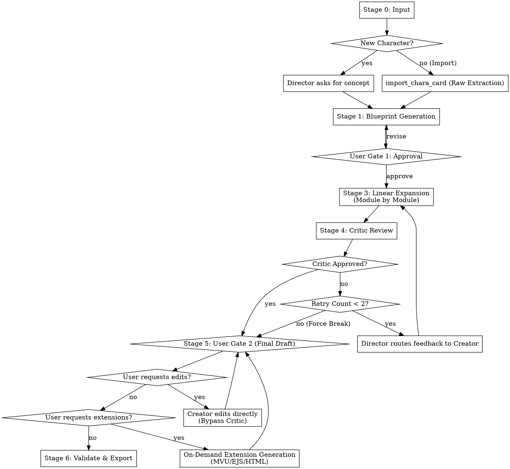

# SillyTavern 角色卡工作流 V3 設計藍圖 (Design Spec)

## 1. 系統架構與核心實體 (System Architecture & Core Entities)

本系統在對話式 CLI 環境 (如 opencode) 內運作，採用「主從式多智能體 (Master-Subagent)」架構，搭配極簡的 MCP 工具集。

*   **Director (主 Agent)**：對話介面本體。負責管理狀態機、引導使用者、追蹤 Token 預算、控制確認閘門 (User Gates)，並在審查階段管理重試計數器。它不是一個獨立的程式腳本，而是主導流程的主要角色 (Persona)。
*   **Creator (Subagent)**：生成核心。遵循 `references/` 中的規則，負責處理所有資料解析、藍圖生成與逐模組草稿撰寫。
*   **Critic (Subagent)**：審查官。負責根據「防 AI 味」與 OOC (Out of Character) 守則評估 Creator 的草稿，並將反饋回傳給 Director。
*   **Forge (MCP 工具集)**：後端工具庫。負責原始資料的讀寫 (I/O)、Schema 驗證、YAML 合併與最終 PNG/JSON 的編譯。

## 2. 流程圖 (Process Flow)

## 3. 各階段詳細說明 (Detailed Stage Breakdown)

### 階段 0：輸入與匯入 (Stage 0: Input / Import)
*   **新卡 (New)**：Director 詢問使用者核心概念與世界觀。
*   **匯入舊卡 (Import)**：Director 呼叫 `import_chara_card`，將上傳的 PNG/JSON 內的原始文字直接提取到可見的 `drafts/` 目錄中。此階段不進行任何 LLM 解析。

### 階段 1：藍圖生成 (Stage 1: Blueprint Generation)
*   Creator 分析輸入資料/舊卡草稿，並生成單一的結構化 YAML 檔案 (`模組0_概覽.yaml`)。
*   此檔案為系統的唯一真相來源 (Single Source of Truth)，內容包含：
    1.  核心關鍵字/概念矩陣
    2.  Token 預算分配
    3.  計畫啟用的外掛 (如有討論到)

### 階段 2：使用者閘門 1 (Stage 2: User Gate 1)
*   Director 暫停流程，展示 `drafts/模組0_概覽.yaml`。
*   開始生成前，使用者必須核准或修改此 YAML 檔案。

### 階段 3：線性展開 (Stage 3: Linear Expansion)
*   Creator 採**逐模組 (Module-by-Module)** 方式生成草稿（例如：先寫外顯，再寫內質，最後寫自我介紹等 7 大學術模組）。
*   這種隔離方式可避免 Context Window 爆滿，實現精準的 Token 追蹤，並在單一模塊寫入失敗時能獨立重試。

### 階段 4：Critic 修正迴圈 (Stage 4: Critic Review Loop)
*   Critic 審查已生成的草稿。
*   **控制權**：Director 掌握狀態機。若 Critic 挑出毛病 (OOC、AI 味)，Director 會檢查重試計數器 (上限 2 次)。
*   若未達上限，Director 將 Critic 的意見退回給 Creator 要求重寫特定模塊 (跳回階段 3)。若達上限，則強制跳出迴圈，進入階段 5。

### 階段 5：使用者閘門 2 (Stage 5: User Gate 2)
*   Director 展示完整草稿供使用者進行最終審閱。
*   **使用者手動覆寫 (User Override)**：若使用者要求手動修改，Director 會指示 Creator 直接套用更改，**完全跳過 Critic 審查**。使用者的意志高於自動化規則。
*   **按需生成外掛 (On-Demand Extensions)**：進階外掛 (MVU, EJS, HTML) 僅在此階段，且**使用者明確要求**時才會生成。

### 階段 6：驗證與打包匯出 (Stage 6: Validation & Export)
*   Forge 工具執行嚴格的 SillyTavern V3 Schema 驗證。
*   若驗證通過，將合併並智慧編譯所有 7 個 YAML 模組，匯出最終的 PNG/JSON 卡片。
